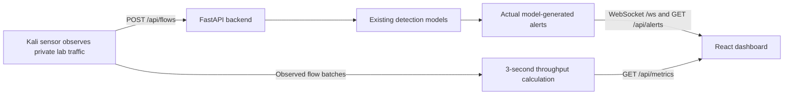

# UniGuard

**SIH 2026 · Problem Statement SIH26145 · Team CeaserX**

UniGuard is a working network-monitoring prototype with a React dashboard, a FastAPI analysis backend, and a Linux/Kali sensor. The sensor observes traffic to a configured private lab target, converts captured packets into directional flow records, and sends those records to the backend. The backend runs its existing detection models and publishes model-produced alerts and live throughput to the dashboard.

> **Prototype scope:** alerts are model predictions, not confirmation that an attack occurred. The current packet-derived flow adapter is not fully equivalent to the CICFlowMeter features used to train the LightGBM model. Treat live classifications as lab evaluation results and expect false positives. This prototype does not generate attacks or traffic.

## What is included

- **Frontend:** React, TypeScript, and Vite dashboard, normally served on port `5173`.
- **Backend:** FastAPI on port `8000`; loads the bundled model artifacts and accepts observed flows at `POST /api/flows`.
- **Sensor:** Linux/Kali packet sensor that captures only traffic to a configured private target IP and destination port, then exports flow records to the backend.
- **Models:** `beacon_cnn`, `charcnn_dns`, and `lgbm_iforest`. This project setup does not retrain them.

## Data flow



The sensor observes traffic; it does not create it. A successful flow submission does not guarantee an alert. Benign traffic may produce no detections, and a threat label such as `SCAN` is a model classification that should be investigated rather than treated as ground truth.

## Repository layout

```text
backend/       FastAPI application, ensemble pipeline, and required model artifacts
frontend/      React dashboard and Vite configuration
sensor/        Linux/Kali flow sensor and setup guide
data/          Small sample data
docs/          Model discovery and prototype setup notes
```

## Run the backend and frontend on Windows

Use separate PowerShell terminals from the repository root.

### 1. Backend

```powershell
cd backend
python -m venv venv
.\venv\Scripts\Activate.ps1
python -m pip install -r requirements.txt
python -m uvicorn app.main:app --host 0.0.0.0 --port 8000
```

Keep this terminal open. Binding to `0.0.0.0` allows Kali to reach the backend. If Windows Firewall blocks the connection, allow TCP port `8000` from the Kali VM's private IP. Do not start a second backend on the same port; stop an existing Uvicorn process with **Ctrl+C** first.

### 2. Frontend

```powershell
cd frontend
npm ci
npm run dev -- --host 0.0.0.0
```

Open `http://localhost:5173` on Windows. From Kali, open `http://<WINDOWS_PRIVATE_IP>:5173`. Allow TCP port `5173` from Kali in Windows Firewall if needed. The Vite development proxy forwards `/api` and `/ws` to the backend at `127.0.0.1:8000` on the Windows host.

## Run the sensor on Kali/Linux

The sensor folder must exist on Kali; the Windows project path is not automatically available inside the VM. Clone the repository on Kali or copy the `sensor/` folder, then install its dependencies:

```bash
git clone https://github.com/BryanFerns1/SIH-26145.git
cd SIH-26145/sensor
sudo apt update
sudo apt install -y python3-venv libpcap-dev
python3 -m venv .venv
. .venv/bin/activate
python -m pip install --upgrade pip
python -m pip install -r requirements.txt
```

Find Kali's route and interface to the Windows host. Replace the example Windows IP with its current private IP from `ipconfig`:

```bash
ip -br address
ip route get <WINDOWS_PRIVATE_IP>
curl http://<WINDOWS_PRIVATE_IP>:8000/api/health
```

Start the sensor with the interface shown by `ip route get`. Replace both placeholders with actual values:

```bash
sudo .venv/bin/python flow_sensor.py \
  --mode private-lab \
  --interface <KALI_INTERFACE> \
  --target <WINDOWS_PRIVATE_IP> \
  --port 5173 \
  --backend-url http://<WINDOWS_PRIVATE_IP>:8000/api/flows \
  --flow-timeout 3
```

The sensor requires packet-capture privileges. For a capture-only check, add `--dry-run`; remove that flag to send observed flows to the backend. Detailed interface, firewall, and troubleshooting guidance is in [`sensor/README.md`](sensor/README.md).

## API and dashboard updates

| Endpoint | Purpose |
|---|---|
| `GET /api/health` | Backend health |
| `GET /api/models` | Loaded model status |
| `POST /api/flows` | Analyze a batch of flow records actually observed by a sensor |
| `GET /api/alerts?limit=100` | Recent model-generated alerts; `limit` is capped at 500 |
| `DELETE /api/alerts` | Clear the backend's in-memory alert list and count |
| `GET /api/metrics` | Current received flow rate, measurement window, and total received flows |
| `WS /ws` | Live alert and pipeline metric messages |

Alert history served by `GET /api/alerts` is in memory and resets when the backend restarts. `DELETE /api/alerts` clears this in-memory list; it does not delete rows from the prototype SQLite database.

The **Flows/sec** card is measured from actual flow records received by `POST /api/flows`. `GET /api/metrics` returns the flow rate over the trailing three-second window, along with the window duration and total flows received since backend startup. The dashboard polls this endpoint once per second; after traffic stops, the rate falls to zero as the window expires. No throughput target is claimed by this measurement.

Example response:

```json
{
  "flows_per_sec": 0.0,
  "measurement_window_seconds": 3.0,
  "total_flows": 0
}
```

Check the API from Windows:

```powershell
Invoke-RestMethod http://127.0.0.1:8000/api/health
Invoke-RestMethod http://127.0.0.1:8000/api/metrics
Invoke-RestMethod http://127.0.0.1:8000/api/alerts
```

## Prototype limitations

- The live sensor emits packet-derived fields marked `packet-derived-lab-v1`. Some field semantics differ from CICFlowMeter; LightGBM scores are therefore for controlled prototype evaluation, not parity with offline evaluation.
- The `SCAN` threat class can be assigned to multiple non-DoS LightGBM attack-class predictions in the current ensemble. It does not necessarily mean a port scan was verified.
- The sensor is restricted to a configured private target and port. This is a lab integration and is not a production receive-only hardware tap or a production deployment guide.
- The alert history and throughput window are in-memory prototype metrics. The rate window is three seconds; the total flow count and alert history reset when the backend process restarts.

For more sensor implementation details, see [`sensor/README.md`](sensor/README.md). For model artifact discovery, see [`docs/MODEL_DISCOVERY.md`](docs/MODEL_DISCOVERY.md).

## Prototype demo

[View the screen recording and screenshots of the prototype demo](https://drive.google.com/drive/folders/1SSa41mV76reUJwQiKMfRAyxqldMEMnto).

## Team

- Shrihari Girish Rodda
- Bryan R Fernandes
- Sourabh Shankar Itagi
- Kiran A Patil
