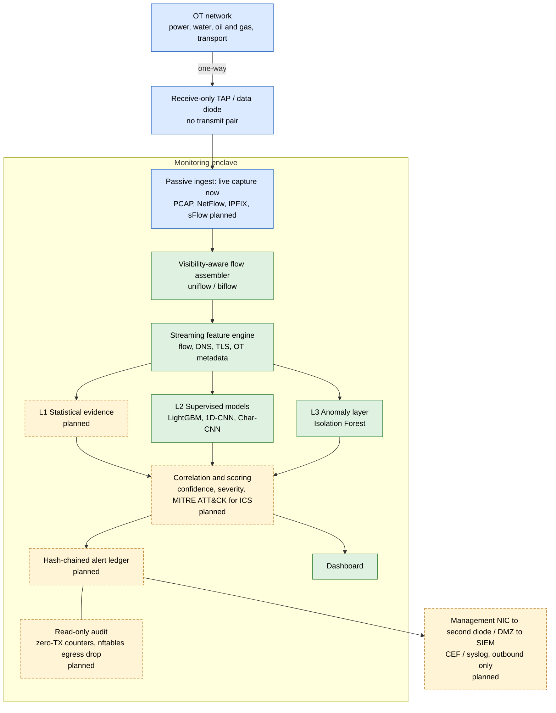

# UniGuard

**AI-driven cyber threat detection for unidirectional IP traffic**

Smart India Hackathon 2026 · Problem Statement **SIH26145** · Team **CeaserX** (ID 168099) · Theme: Blockchain & Cybersecurity

UniGuard is a prototype for analyzing one-way network flow telemetry. It has a Linux/Kali sensor that observes packets bound for one configured private lab server, a FastAPI service that runs three bundled model families, and a React dashboard that displays returned predictions. The sensor does not generate traffic.

> **Scope note.** This repository demonstrates a lab pipeline. Its packet-derived LightGBM inputs are not CICFlowMeter-equivalent. A model prediction is not proof of an attack. The checked-in sample CSV produces model predictions with placeholder addresses and is suitable only for a pipeline smoke test.

For the source-by-source inventory, evaluation evidence and open information requests, see [README_FACTS.md](README_FACTS.md).

## Contents

1. [Background](#background)
2. [Quick demo](#quick-demo)
3. [Architecture](#architecture)
4. [Problem mapping](#problem-mapping)
5. [Constraint evidence](#constraint-evidence)
6. [Measured results](#measured-results)
7. [Models, features and training](#models-features-and-training)
8. [Output examples](#output-examples)
9. [Installation and live sensor](#installation-and-live-sensor)
10. [Dashboard](#dashboard)
11. [Project structure](#project-structure)
12. [Datasets](#datasets)
13. [Compliance, limitations and roadmap](#compliance-limitations-and-roadmap)
14. [Team](#team)
15. [References and license](#references-and-license)

## Background

Critical-infrastructure operators often watch gateway and peering links through passive mirroring or hardware data diodes. The monitoring enclave sees traffic in one direction only and has no path back into the production network. This removes a class of attack in which a compromised monitoring system becomes a pivot into the core network.

The trade-off is that any analytics in the enclave must work from passive data alone. It cannot probe the source, complete a handshake or push a mitigation back. UniGuard targets this setting with an AI/ML pipeline that scores flows, DNS names and packet sequences and shows labelled alerts with confidence and severity on a dashboard.

The six threat classes in the problem statement are volumetric/protocol DDoS, botnet C2 beaconing, DGA and DNS tunnelling, malware in encrypted sessions, reconnaissance/port scanning and data exfiltration. [Problem mapping](#problem-mapping) states which are covered today.

## Quick demo

Requirements: Python and Node.js/npm; the repository declares no supported version range. The backend Docker image uses Python 3.11, and setup was exercised on Python 3.13.13 and Node 24.21.0. Docker is optional, but Docker Compose was not tested for this checkout. Commands below use PowerShell from a cloned repository.

**1. Clone and install the backend, then start it in terminal 1:**

```powershell
git clone https://github.com/BryanFerns1/SIH-26145.git
cd SIH-26145\backend
python -m venv .venv
.\.venv\Scripts\Activate.ps1
python -m pip install -r requirements.txt
python -m uvicorn app.main:app --host 127.0.0.1 --port 8000
```

**2. Install and start the dashboard from the repository root in terminal 2:**

```powershell
cd ..\frontend
npm ci
npm run dev
```

**3. Open `http://localhost:5173`.** In terminal 3, from the repository root, send the checked-in 50-row sample to the API:

```powershell
cd ..
$flows = @(Import-Csv 'data\samples\sample_50.csv' | ForEach-Object {
  $row = [ordered]@{}
  foreach ($p in $_.PSObject.Properties) {
    if ($p.Name -ne 'Label') { $row[$p.Name] = if ($p.Value -eq '') { $null } else { [double]$p.Value } }
  }
  $row
})
Invoke-RestMethod http://127.0.0.1:8000/api/flows -Method Post -ContentType 'application/json' -Body (ConvertTo-Json -InputObject $flows -Depth 10)
```

The smoke run performed during repository inspection returned:

```json
{"flows_received":50,"alerts_generated":50,"processing_time_ms":137.501}
```

The returned alert classes were 40 `SCAN` and 10 `DDOS`. These sample predictions have empty flow IDs and `0.0.0.0:0` addresses because the CSV has no addresses, DNS names or packet sequences. They are not a live attack demonstration, and a future model or runtime may return different predictions. The API response was verified; the browser rendering of these alerts was not visually checked. The 137.501 ms value is model processing time for one batch, not clone-to-visible-alert time. Live packet capture is Linux-only and is described under [Installation and live sensor](#installation-and-live-sensor).

## Architecture

### Implemented pipeline

```mermaid
flowchart LR
  subgraph NET["Private lab network"]
    TR["Traffic to one private lab server"]
  end

  subgraph SEN["Linux / Kali sensor - receive-only capture"]
    CAP["Scapy sniff, store=False"]
    ASM["Directional flow assembler"]
    EXP["Export on FIN/RST, idle or active timeout"]
    CAP --> ASM --> EXP
  end

  subgraph API["FastAPI backend"]
    ING["POST /api/flows"]
    subgraph MODELS["Three model families"]
      LG["LightGBM + Isolation Forest<br/>flow classification and anomaly"]
      BC["Beacon 1D-CNN<br/>32 packets x 7 channels"]
      DN["DNS Char-CNN<br/>DGA and tunnelling"]
    end
    SCORE["Map to threat class, severity and confidence"]
    ALERT["Alert with SHA-256 hash"]
    ING --> LG
    ING --> BC
    ING --> DN
    LG --> SCORE
    BC --> SCORE
    DN --> SCORE
    SCORE --> ALERT
  end

  DB[("SQLite alert store")]
  WS["WebSocket /ws<br/>NEW_ALERT, METRICS_UPDATE"]
  UI["React + Vite dashboard<br/>Overview, Alerts, Hosts, Models, Settings"]

  TR -->|"mirrored, one direction"| CAP
  EXP -->|"HTTP flow records"| ING
  ALERT --> DB
  ALERT --> WS --> UI
  DB -->|"GET /api/alerts, /api/metrics"| UI

  classDef net fill:#fde8d8,stroke:#c2570c,color:#000
  classDef sensor fill:#dff2e1,stroke:#2e7d32,color:#000
  classDef model fill:#e8def8,stroke:#6a3fb5,color:#000
  classDef out fill:#dbeafe,stroke:#1d5fbf,color:#000
  class TR net
  class CAP,ASM,EXP sensor
  class LG,BC,DN model
  class ING,SCORE,ALERT,DB,WS,UI out
```



The sensor filters live Linux capture to packets whose destination is the configured private lab IP and destination port. It derives directional flow fields and exports completed flows on FIN/RST, idle timeout or active timeout. The app currently processes incoming batches directly; it is not a bounded micro-batch worker. The dashboard polls alert history every three seconds and metrics every second, and reconnects to the WebSocket.

### Target architecture (roadmap)

This is the design from the SIH proposal. Green nodes exist in the repository today; dashed yellow nodes are planned.



## Problem mapping

| SIH threat class | Current status |
|---|---|
| Volumetric/protocol DDoS | Partial. CIC-style LightGBM class labels can map to `DDOS`; no explicit SYN flood, UDP reflection/amplification, spoofed-source or source-IP-entropy detector. |
| Botnet C2 beaconing | Partial. A 1D CNN scores up to 32 forward packet sizes, inter-arrival times and TCP flags per completed flow. No repeated-flow periodicity, jitter analysis or benign beacon down-weighting in the active app. |
| DGA and DNS tunnelling | Partial. Char-CNN runs on an observed DNS query name and uses lexical features. No DNS record-type anomaly model. |
| Malware in encrypted sessions | Not implemented. No JA3/JA3S/JA4, TLS malware classifier or QUIC handling. No payload decryption. |
| Reconnaissance/port scanning | Partial. A LightGBM `Portscan` label maps to `SCAN`, but the active mapping also labels any multiclass output other than one containing `DoS` as `SCAN`, including `BENIGN`, once the binary score passes review. Horizontal/vertical fan-out is not implemented. |
| Data exfiltration | Not implemented. No outbound/inbound volume ratio or asymmetry detector. |

## Constraint evidence

| Constraint | Evidence and status |
|---|---|
| Read-only ingest | `sensor/flow_sensor.py` uses Scapy `sniff(..., store=False)` and makes HTTP flow submissions; no packet-transmit call is present. This is source evidence for the sensor behavior, not hardware diode or zero-TX verification. |
| No payload decryption | No decryptor exists. The sensor reads packet headers, payload lengths and optional clear DNS question metadata. It does not export or store raw payload bytes in its flow records. Whole-host storage and log auditing has not been performed. |
| Streaming with bounded state and mid-stream alerts | Capture is callback-driven; packet sequence input is limited to 32, export queue to 10,000 and recent alert deque to 500. Flow dictionary and per-flow stats are not count/byte capped. Alerts are emitted after flow completion, so mid-flow alert emission is not demonstrated. HyperLogLog and Space-Saving are absent from the active runtime. |
| Throughput target | `5000` flows/s appears as a config default only. End-to-end sustained throughput, Mbps and p99 at target have not been measured. |
| Standard alert validation | Pydantic `Alert` is defined in `backend/app/schemas.py`; the API accepts untyped dictionaries and the constructed alert does not require a nonempty flow ID or evidence features. The current smoke output had an empty flow ID, no MITRE references and no evidence features. |

## Measured results

### Inspection-run results

- Frontend production build passed with Vite 8.3.2. One bundle-size warning notes a JavaScript chunk larger than 500 kB.
- Sensor unit suite: 5 passed on the inspection host using the available Scapy package.
- Backend ensemble test suite: blocked by stale imports. `test_ensemble_attack_mapping.py` asks for `lgbm_input_is_compatible`, which is absent in the active `backend/app/pipeline/ensemble.py`.
- Frontend lint exits successfully with 10 warnings.
- API smoke: 50 flows accepted, 50 alerts returned, one batch processing time 137.501 ms. This is not a sustained throughput or latency-percentile measurement.
- Not measured: Docker/Compose, Linux capture, p50/p95/p99 at load, Mbps, false-positive rate per time or flow count, CPU/RAM under test, attack-load continuity and comparison to targets.

### Archived model-only reruns

The archived evaluator in `scratch/model_extract/newmodel/newmodel/` was run against its saved feature parquets and models. It reports a Friday held-out test with 288,796 rows.

| Tier | Confusion matrix | Benign FPR | Attack recall |
|---|---|---|---|
| Binary HIGH | `[[238070, 756], [222, 49748]]` | 0.32% | 99.56% |
| Binary REVIEW | `[[235264, 3562], [182, 49788]]` | 1.49% | 99.64% |

These do not evaluate sensor-to-dashboard behavior. The same evaluator's multiclass F1 varies: DDoS 1.000 (19,306 rows), Portscan 0.893 (1,945) and DoS Slow 0.608 (313). See [README_FACTS.md](README_FACTS.md) for all class supports and weak classes.

An archived benchmark script measured **9,257 flows/s** and p50/p95/p99 model inference of **15.687 / 20.211 / 23.170 ms** on the inspection host, pinned to one CPU. This passes the requested numeric ≥5,000 flows/s and p99 <1 s thresholds for that model-only workload. It does not establish end-to-end throughput, and no Mbps or maximum ceiling was measured. Evaluation details, perturbation results and hardware are in [README_FACTS.md](README_FACTS.md).

### Model-card results (recorded in artifacts, not rerun for this README)

| Detector | Recorded metrics and scope |
|---|---|
| LightGBM binary | CIC-IDS2017 Improved: high tier recall 99.56%, precision 99.9%, FPR 0.31%; review tier recall 99.64%, precision 99.9%, FPR 1.49%. Card also records 13,209 flows/s and p99 15.6 ms for a one-core model benchmark. |
| Beacon CNN | CTU-13 binary test: precision 99.36%, recall 83.79%, F1 90.91%, ROC-AUC 0.938, PR-AUC 0.9786. At the HIGH threshold test FPR is 3.28%; at the REVIEW threshold test FPR is 48.59%. |
| DNS Char-CNN | 10,769 samples: accuracy 93.21%; benign P/R/F1 0.9212/0.9793/0.9494 (7,000), DGA 0.9150/0.7269/0.8102 (2,146), DNS tunnel 1/1/1 (1,623). |
| Isolation Forest | Card records 1.19% benign FPR, 78.7% Portscan recall and 1.8% DDoS recall. |

These are artifact-reported model results with distinct datasets and evaluation scopes. They do not establish performance for the live sensor, all six SIH classes or the end-to-end system. Cross-capture versus random-split comparison, 4SICS/HAI results, drift, ablation and full-system evasion results are not established for the current running app. Archived reports are identified separately in [README_FACTS.md](README_FACTS.md).

## Models, features and training

The backend loads three model-card families from `backend/artifacts/`:

1. **`lgbm_iforest`**: binary LightGBM, 10-class LightGBM and a benign-trained Isolation Forest. LightGBM input is 28 forward-only base features plus 10 derived ratios, rates and dispersion values; no backward or bidirectional fields.
2. **`beacon_cnn`**: ONNX 1D CNN over 32 packets × 7 channels: log packet size, log inter-arrival time, padding mask and TCP SYN/FIN/RST/PSH bits. Isotonic calibrator; review threshold 0.4286 and high threshold 0.9149.
3. **`charcnn_dns`**: ONNX character model over 128 tokens and 18 lexical features. Temperature scaling is embedded; DGA threshold 0.6551 and tunnel threshold 0.1. The active feature extractor sets `dict_word_ratio` to zero and uses whole-domain entropy for `subdomain_entropy`.

The cards name CIC-IDS2017 Improved, CTU-13 and a DNS threats multiclass dataset. The app repository does not include their complete source data or dataset licenses. This application setup does not retrain models. Archived training and evaluation scripts exist in `scratch/model_extract/` but refer to external paths and are not part of the backend runtime. See [README_FACTS.md](README_FACTS.md) for feature order, hyperparameters, data splits and exact missing evaluation items.

## Output examples

The `Alert` model in `backend/app/schemas.py` defines IDs and timestamps, tuple, class, severity, confidence, per-model scores, rules, MITRE references, evidence, explanation, incident ID, previous hash and hash. Actual output is thinner than this intended schema. The API smoke alert predicted DDoS:

```json
{
  "threat_class": "DDOS",
  "severity": "CRITICAL",
  "confidence": 0.9259259259259259,
  "flow_id": "",
  "five_tuple": {"src_ip":"0.0.0.0","src_port":0,"dst_ip":"0.0.0.0","dst_port":0,"proto":"0"},
  "evidence": {"observability":"uniflow_fwd_only"},
  "mitre": [],
  "prev_hash": "",
  "hash": "c06ae1cd8a81cc3624af111c4d3537c69eb80a3d9fd4499684f2d61973a52797"
}
```

This is a model prediction on archived CSV flow values, not a confirmed DDoS. No C2, DGA, DNS tunnel, TLS malware or exfiltration alert was generated by the smoke run. Incident correlation, CEF/syslog export and an active hash-chained ledger are not present. The per-alert SHA-256 hash does not establish a blockchain or a linked chain.

When running, WebSocket messages are JSON envelopes:

```json
{"type":"NEW_ALERT","data":{"alert_id":"...","threat_class":"..."}}
{"type":"METRICS_UPDATE","data":{"flows_per_sec":0.0,"models":[]}}
```

## Installation and live sensor

### Backend and dashboard

From the repository root, open one terminal for the API:

```powershell
cd backend
python -m venv .venv
.\.venv\Scripts\Activate.ps1
python -m pip install -r requirements.txt
python -m uvicorn app.main:app --host 0.0.0.0 --port 8000
```

Then open a second terminal:

```powershell
cd frontend
npm ci
npm run dev -- --host 0.0.0.0
```

Open the Vite URL printed in the terminal (normally `http://localhost:5173`). API health is `http://localhost:8000/api/health`; interactive docs are at `http://localhost:8000/docs`. The local database defaults to `backend/uniguard.db` when the server is started from `backend/`. Alert history and throughput counts also live in process memory and reset when the backend restarts.

The backend requirements pin FastAPI, Uvicorn, Pydantic, SQLAlchemy and several utility packages, but leave NumPy, pandas, scikit-learn, LightGBM, Joblib and ONNX Runtime unpinned. The frontend lockfile is committed.

### Linux/Kali sensor

The sensor is live capture on Linux/Kali only. It requires permission to capture packets and a controlled private target, port and interface. No attack generator is included. From `sensor/`:

```bash
sudo apt update
sudo apt install -y python3-venv libpcap-dev
python3 -m venv .venv
. .venv/bin/activate
python -m pip install -r requirements.txt
sudo .venv/bin/python flow_sensor.py \
  --mode private-lab \
  --interface <KALI_INTERFACE> \
  --target <PRIVATE_LAB_TARGET_IP> \
  --port <TARGET_PORT> \
  --backend-url http://<BACKEND_PRIVATE_IP>:8000/api/flows \
  --flow-timeout 3
```

Use `--dry-run` first to print exported flow JSON without calling the backend. The sensor only accepts an RFC1918, loopback or IPv6 ULA target, and only observes traffic directed to that target and port. See [sensor/README.md](sensor/README.md) for interface selection and firewall examples. A production diode, zero-TX counters, nftables egress-drop configuration and Windows/Linux reachability have not been verified here.

### Docker Compose

`docker-compose.yml` defines TimescaleDB, Redis, the API and an nginx dashboard. Docker was not available during inspection, so the following was not executed:

```bash
docker compose up --build
```

The current backend code defaults to SQLite and does not consume Redis. Compose points the API to PostgreSQL using `asyncpg`, which is not listed in the backend requirements. Review `DATABASE_URL`, the hard-coded Compose development credentials and the service wiring before using the stack beyond a local prototype.

## Dashboard

The active app (`frontend/src/App.tsx`) provides Overview, Alerts, Hosts, Models and Settings views. It displays recent model predictions, severity, confidence, flow tuple, model status and batch processing metrics. The page receives live events through `/ws`; historical alerts are fetched from `/api/alerts`.

API routes: `GET /api/health`, `GET /api/models`, `GET /api/metrics`, `POST /api/flows`, `GET /api/alerts`, `DELETE /api/alerts` and `POST /api/metrics/http-activity`; WebSocket `/ws`. Docs: `/docs`.

There are no screenshot or recording files in the repository. Add them under `docs/` and link them here before submission.

## Project structure

```text
backend/       FastAPI app, inference pipeline, three model families
data/          50-row CSV used in the API smoke demo
docs/          Model discovery notes
frontend/      React/TypeScript/Vite dashboard
scratch/       Archived experiment scripts, results and logs
sensor/        Linux/Kali private-lab packet capture and flow export
```

## Datasets

Model cards name CIC-IDS2017 Improved for flow classification and anomaly scoring, CTU-13 for beacon classification, and a DNS Threats multiclass dataset for DGA/tunnel classification. The complete source datasets and licenses are not included. 4SICS and HAI are not configured; archived config sets their paths to `None`. Cross-dataset CIC-IDS2018 testing is explicitly untested in the LightGBM card.

## Compliance, limitations and roadmap

**Current coverage is partial.** Flow, DNS and packet-sequence model inference and a dashboard are wired. Several SIH detectors and the requested evidence and performance systems remain incomplete. The sensor reports packet-derived lab fields and waits for flow completion. It does not parse PCAP files, NetFlow/IPFIX/sFlow, QUIC, TLS fingerprints, Modbus, DNP3 or IEC 104. No payload decryption is implemented.

**Known gaps:**

- Cross-capture and OT validation (4SICS, HAI), target throughput, alert latency percentiles, benign-only false alert rates, PSI drift and ablation results still need measured artifacts.
- `BENIGN` predictions can be labelled `SCAN` once the binary score passes review.
- Alerts have an empty `flow_id`, no MITRE references and no evidence features in the current output.
- Backend ensemble tests fail on a stale import.
- Docker Compose wiring is inconsistent with the backend code.

**Recommended next work:**

1. Fix the `BENIGN` to `SCAN` mapping, generate flow IDs and attach evidence features to every alert.
2. Chain `prev_hash` across alerts and add a ledger verification command.
3. Add a static MITRE ATT&CK mapping, incident correlation and CEF/syslog export.
4. Add rule-based scan, source-IP entropy and exfiltration-ratio detectors.
5. Add JA4/TLS metadata handling and DNS record-type features.
6. Enforce bounded flow state and validate alerts against the schema.
7. Run versioned cross-capture and end-to-end throughput and latency evaluations with `tcpreplay`.

**Regulatory context.** The design aims to align with the DPDP Act 2023 (metadata only), CERT-In directions of April 2022 (6-hour incident reporting and 180-day log retention), NCIIPC guidelines, IEC 62443 and IT Act 2000 Section 70. These alignments depend on the planned ledger and audit components and are not yet demonstrated by this repository.

The working facts and the specific commands and data needed are listed in [README_FACTS.md](README_FACTS.md).

## Team

**Team CeaserX** · Team ID 168099 · Theme: Blockchain & Cybersecurity

| Member | Role and contributions |
|---|---|
| **Sourabh Shankar Itagi** | Research, LightGBM model, Isolation Forest, website development |
| **Shrihari Girish Rodda** | Website development, 1D-CNN (beacon) model, research |
| **Kiran A Patil** | Char-CNN (DNS) model, research, presentation |
| **Bryan R Fernandes** | Research, presentation |
| **Saniya B** | Presentation |
| **Sneha A** | Presentation |

## References and license

Model notes are in [docs/MODEL_DISCOVERY.md](docs/MODEL_DISCOVERY.md). Source dataset citation URLs and license evidence are not recorded in this checkout.

Key references from the SIH submission:

1. I. Sharafaldin, A. H. Lashkari, A. A. Ghorbani, "Toward Generating a New Intrusion Detection Dataset and Intrusion Traffic Characterization," ICISSP, 2018.
2. G. Engelen, V. Rimmer, W. Joosen, "Troubleshooting an Intrusion Detection Dataset: the CICIDS2017 Case Study," IEEE S&P Workshops, 2021.
3. S. García, M. Grill, J. Stiborek, A. Zunino, "An empirical comparison of botnet detection methods," Computers & Security, vol. 45, 2014.
4. I. Sharafaldin et al., "Developing Realistic Distributed Denial of Service (DDoS) Attack Dataset and Taxonomy," IEEE ICCST, 2019.
5. G. Ke et al., "LightGBM: A Highly Efficient Gradient Boosting Decision Tree," NeurIPS, 2017.
6. F. T. Liu, K. M. Ting, Z.-H. Zhou, "Isolation Forest," IEEE ICDM, 2008.
7. N. R. Lomb, Astrophysics and Space Science, vol. 39, 1976; J. D. Scargle, Astrophysical Journal, vol. 263, 1982.
8. B. Trammell, E. Boschi, "Bidirectional Flow Export Using IP Flow Information Export (IPFIX)," RFC 5103, IETF, 2008.

**License:** the repository contains no license file, so no reuse license should be assumed. Add a `LICENSE` file (for example MIT or Apache-2.0) before publishing.
